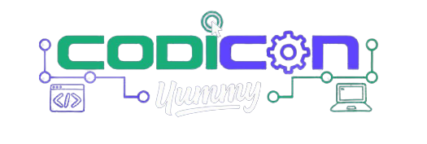

# FundEase



FundEase es un proyecto presentado en la Hackathon de Codicon 2023, patrocinada y organizada por [Yummy](https://www.yummysuperapp.com/), con este propuesta se busca facilitar la utilidad del sobrante en efectivo utilizado en los pagos de servicios en apps mobile para servicios de transporte, comida, etc. para que este pueda ser donado a fundaciones sin fines de lucro, simplificando el proceso de pago al prestador del servicio al evitar la gestión del vuelto entre usuario y prestador.

## Contribuidores

Este proyecto fue construido por un grupo multidisciplinario de jovenes Venezolanos, siendo estos:

- Ángel Calderón - Frontend Dev
    - [Github](https://github.com/Doble-2)
    - [Linkedin](https://www.linkedin.com/in/angeld2/)
- Alexis Fraudita - Backend Dev
    - [Github](https://github.com/alefram)
    - [Linkedin](https://www.linkedin.com/in/alefram/)
- Darwin Lozada - Frontend Dev
    - [Github](https://github.com/DarwinLozada)
    - [Linkedin](https://www.linkedin.com/in/darwin-lozada-41443b194/)
- Jorge Alfonzo - Fullstack Dev
    - [Github](https://github.com/gorritocodes)
    - [Linkedin](https://www.linkedin.com/in/gorritocodes/)
- Jorge Thomas - Devops
    - [Github](https://github.com/Akrista)
    - [Linkedin](https://www.linkedin.com/in/akrista/)

El talento combinado y visión de este grupo nos ha permitido mostrar nuestra visión de una propuesta viable para el mercado de mobile apps en Venezuela donde se ofrecen beneficios a Organizaciones Sin Fines de Lucro.

## Demo

Puede probar una demo del proyecto aca: [https://akrista.github.io/codicon-05-front/order](https://akrista.github.io/codicon-05-front)

[demo.webm](https://github.com/Akrista/codicon-05-front/assets/23145794/1c44bbfd-1a1e-46a8-b6cc-111d51396780)

## Probar el Proyecto

Recuerde copiar el archivo `.env.example` a `.env` y configurar el endpoint asociado al .

Si posees docker instalado, puedes simplemente ejecutar el script `run.sh`

Puede ejecutar fácilmente el proyecto de dos maneras:

### Via Docker

Se requiere tener instalado [Docker](https://docs.docker.com/get-docker/) y [Docker Compose](https://docs.docker.com/compose/install/).

```bash
# Compilar la imagen
docker-compose build
# Correr el proyecto
docker-compose up -d --force-recreate
```

### Via NPM / Yarn / PNPM

Se requiere tener instalado [Node.js](https://nodejs.org/en/download/).

```bash
# Instalar dependencias
npm install
# Correr el proyecto
npm run dev
# Con Yarn
yarn install
yarn dev
# Con PNPM
pnpm install
pnpm dev
```

## Producción

Para desplegar esta app en producción, encontrara en el archivo `docker-compose.yml` una sección de "labels" y un contenedor adicional llamado [Traefik](https://traefik.io/traefik/). Este servicio permite crear un reverse proxy http, de manera que se proteja el trafico recibido.

Para adicionar dicho servicio, asegurese de:

1. Comentar los puertos del app
2. Descomentar las labels, networks y el contenedor de traefik
3. Asignar el ip de su URL Publica para el app en el label ``traefik.http.routers.fundease.rule=Host(`your.domain.com`)``
4. Cree una carpeta llamada "config" en el root de este repo
5. Cree una copia del archivo traefik.yml.example en la carpeta recien creada, el archivo debe llamarse "traefik.yml"
6. Ejecute el script `run.sh`
